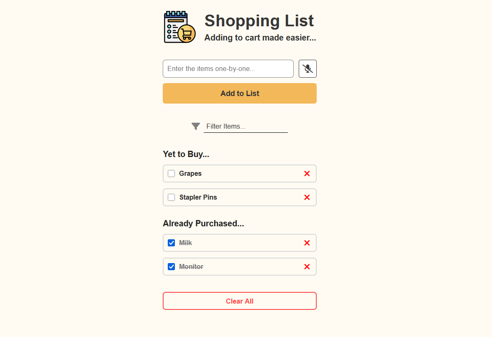

# 🛒 Shopping List

A simple, modern shopping list web app to help you manage your grocery or shopping items with ease. Add, filter, update, and remove items—your list is saved in your browser!

## Features

- **Add Items:** Enter items one by one and add them to your shopping list.
- **Update Items:** Click on an item to edit and update it.
- **Remove Items:** Remove individual items using the ❌ button.
- **Clear All:** Remove all items from your list with a single click.
- **Filter:** Instantly filter your list as you type.
- **Persistent Storage:** Your list is saved in your browser's localStorage.

## Demo



## Getting Started

1. **Clone or Download this repository.**
2. Open `index.html` in your browser.

No build tools or server required—just open and use!

## Project Structure

```
/Shopping-list
│
├── index.html        # Main HTML file
├── style.css         # App styling
├── script.js         # App logic (vanilla JS)
└── images/
    └── shoppingList-icon.png
```

## Usage

- **Add an item:** Type in the input and click "Add to List".
- **Edit an item:** Click the item text, edit, then click "Update Item".
- **Remove an item:** Click the ❌ button next to the item.
- **Clear all:** Click "Clear All" at the bottom.
- **Filter:** Use the filter box to search your list.

## Tech Stack

- HTML5
- CSS3
- JavaScript (ES6+)
- [Font Awesome](https://fontawesome.com/) for icons

_Happy shopping!_
